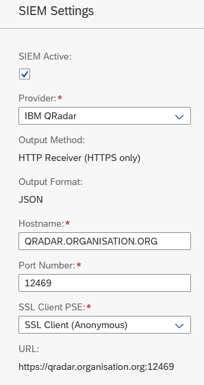

# Use Case Policies

If you have been granted the security configurator role or the administrator role, you can access the Use Case Policy  Fiori Tile. Please visit [this](../system-configuration-fiori-application/users-and-authorizations/authorizations.md) page for more details regarding the authorisations.

<figure><figcaption>
Use Case Policy Configuration
</figcaption></figure>

To limit false positives, it is important to configure the allow / deny policies specifically according to your situation. No SAP landscape is similar and use cases need some tweaking and tuning in order to be effective, to limit false positives and add specific data for your situation. All fields are wildcard-enabled and you can use the SAP standard escape characters (like #, + and \*), see note  [574914](https://launchpad.support.sap.com/#/notes/574914) for details. Below overview lists the attributes for the allow / deny policies:

### **Attribute legend:**

| Attribute name:  | Description of the attribute:                                                                                                                                                                                                                                                                                                                                                                                                |
| ---------------- | ---------------------------------------------------------------------------------------------------------------------------------------------------------------------------------------------------------------------------------------------------------------------------------------------------------------------------------------------------------------------------------------------------------------------------- |
| Policy ID        | The unique identifier number for the policy, Allow policies starts with 1000, Deny policies starts with 2000                                                                                                                                                                                                                                                                                                                 |
| Default          | Indicates whether this policy is the initial shipped or not                                                                                                                                                                                                                                                                                                                                                                  |
| Description      | Human readable description of the policy                                                                                                                                                                                                                                                                                                                                                                                     |
| Restriction Type | Indicates whether the policy is an allow or deny policy                                                                                                                                                                                                                                                                                                                                                                      |
| Scope            | Type of systems this policy applies to                                                                                                                                                                                                                                                                                                                                                                                       |
| Case Sensitive   | Indicates whether the values entered are Case sensitive or not                                                                                                                                                                                                                                                                                                                                                               |
| Wildcard Enabled | 
Indicates whether the wildcard symbol (asterisk) can be used or will be seen as a wildcard.  Note, if the policy is related to users, where the username starts with SAP, do not use wildcard, but enter the user(s) manually. This is because of the existence of the emergency user that exist in the system (SAP*). In general you would not want anyone to misuse the emergency user SAP* to perform anything.
 |
| Risk Enabled     | Indicates whether the risk field is included along                                                                                                                                                                                                                                                                                                                                                                           |
| Final            | Indicates whether the default shipped policy can be copied or not by customers. When Final = NO the default policy can be copied and customized by customers                                                                                                                                                                                                                                                                 |
| Technical Name   | Technical name of the policy which will be used to assign the policy to an use case along with the Policy ID                                                                                                                                                                                                                                                                                                                 |

