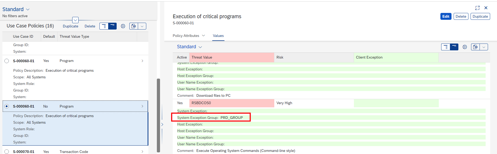

# Configuring Use Case Policies with Groups

Within the Use Case Policy application you can work with [groups](../group-application.md). In order to make use of a group you first need to have created a group.

In this example we will be re-using the PRD\_GROUP we created in our example shown earlier.

<figure><figcaption>
System group
</figcaption></figure>

Depending on what kind of group you have created, you can use that group for the particular group exemptions in the use case policies. To use a group in the policy, simply enter the group name for the corresponding Threat Value you would like to create an exception for, for example:

<figure><figcaption></figcaption></figure>

Only 1 group can be assigned per Threat, should you have multiple groups, you can define different lines with each a different group per Threat Value, should you wish to do so.

#### Combining standard exceptions & exception groups

The standard exceptions can be defined and mixed with groups. The exception handling is an AND operator. It is recommended to use groups over individual values as this avoids repetitive configuration and in the end it will be easier to administer via the Groups application.

#### Deleting a group

If a group is used in a Policy, the group cannot be deleted. The delete option will be greyed-out. Should you however delete a system that has been assigned in one or more groups. The group will be updated. The system that was in the group will be removed automatically from the group as well.

