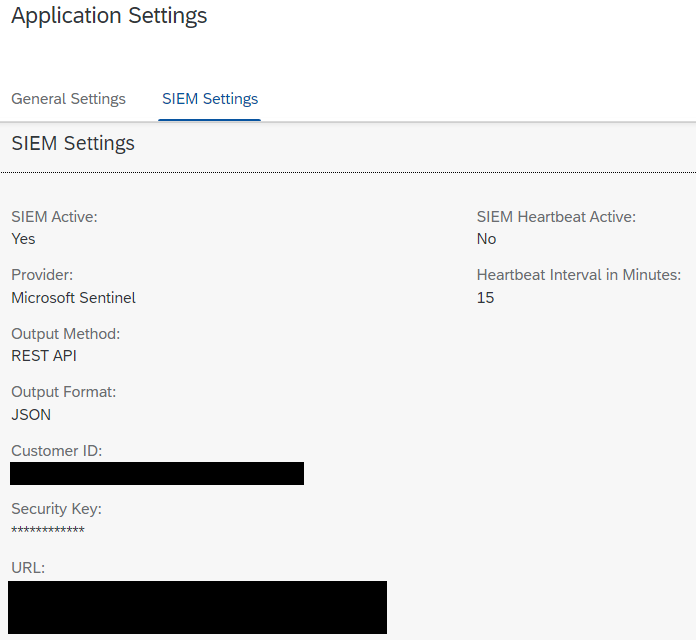

# Post-installation processing

### Run the post-installation wizard 

After the installation via transaction SAINT is done, run the post-installation wizard **in the client where Protect4S TD needs to run,** not in client 000. The post-installation wizard is started by executing transaction: **/n/TDWO/PI**. The wizard will activate the [necessary SICF services](../troubleshooting/sicf-services.md) and will also prompt for the license installation.

### License installation 

Protect4S TD needs a valid license in order to function. From the post-installation wizard you are prompted to install a valid license. . A valid license file will be supplied by the Protect4S Support team during the purchasing process.

#### Requesting a Protect4S TD license 

Requesting a new Protect4S TD license can be done by selecting the option "Request license":

<figure><figcaption></figcaption></figure>

This will compose an email with a template. Please fill out the required information shown in the mail. This is required for Protect4S support to generate your license file:

<figure><figcaption></figcaption></figure>

Then, send the mail to us and we will generate a license file for you. Should you have lost this file or never received it, please contact the Protect4S support team.

#### Uploading the license file

From the License Administration application press the button: 

This will start up a new screen in which you can upload and save the license key file:

After uploading and saving the license key file, you will be able to see the license in the overview in the License Administration:

<figure><figcaption></figcaption></figure>

After having installed the license: select **Yes**.

 (1).png>)

### Application Settings

During the post-installation steps, inspect and update at least the mandatory fields in the Application Settings. Later, when using the Protect4S TD application you can configure the more detailed [application settings](../../application-setup/application-settings.md) like for example the SIEM settings.

 (1) (1).png>)

A lot of specific tuning can be done when working with the application. For now, after installation, at least provide a name for the Worker ID, A Company name and a background user for the background jobs. This must be a user with the role **/TDWO/BACKGROUND\_EXECUTOR** and the Logon Language and Date Format settings for this user must be set to this default in SU01:

<figure><figcaption></figcaption></figure>

After the Post-Installation processing is done, the application is ready to be used. The Protect4S Threat Detection solution is started via transaction: `/n/ui2/flp`, which opens the Fiori launchpad containing the Protect4S TD applications. Should the transaction timeout, please refresh the page again with the F5 key or set a higher value for SAP parameter **rdisp/plugin\_auto\_logout** using transaction: **RZ11**. After running the Post installation wizard, refresh your browser cache (CTRL-F5) to make sure the application icons are displayed correctly.

Every menu Item selected will start in a new browser tab for many browsers (for some browsers like Edge it will open new browser windows though). When you are finished using an application, you may simply close the tab or windows.
